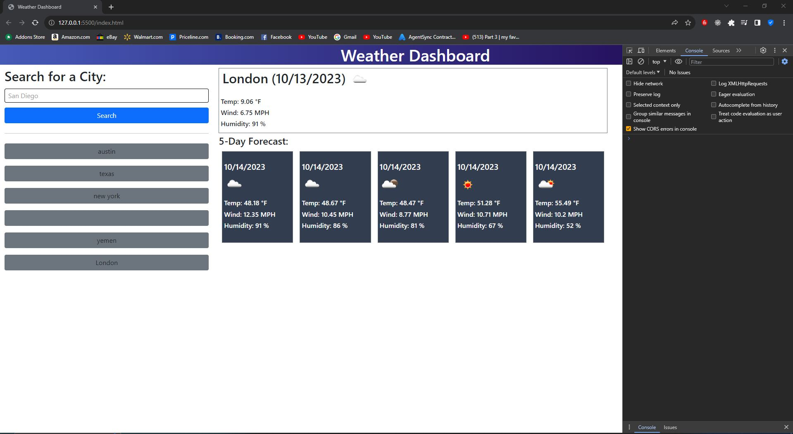

# Module 6 challenge 

## Description

My motivation whilst creating this repository was to make an application that allows me to schedule trips or make plans by knowing the weather/forecast for my destination city. I accomplished this by utilizing jquery and dayjs aswell as openweather api database to get current weather adn forecast. I display the up to date weather and forecast when called as well as saving recent searches to easily check back at your last search.

## Table of Contents 

N/A

## Installation

N/A

## Usage

This application can now be utilized by anyone who would like to searcha city and get the current weather and forecast to plana round with.

## Credits

N/A

## License

Please refer to the LICENSE in the repo.

## Screenshot

## Deployment link

